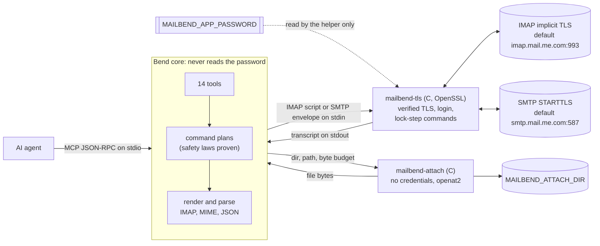

# MailBend

Lightweight, Linux-first IMAP/SMTP connector for AI agents, with iCloud Mail
as the default and live-tested profile. The core is
written in [Bend 2](https://github.com/bendlang/bend); a small C helper
does verified TLS. MailBend exposes mail as MCP tools (stdio) and as a CLI.

> **Status: prototype.** Every tool passes an end-to-end suite against a local
> TLS IMAP/SMTP server. User-reported live iCloud results on Grok Bot cover
> probe, folders, search, get, new mail, flags, move, trash, disposable-message
> delete, sending with an attachment, reply-send and forward-send. The three
> draft paths failed when the server advertised only some folder roles; the
> repair has local test coverage and awaits a live retest. Start with a test
> mailbox, or set `MAILBEND_READ_ONLY=1`.

## What it can do

| Tool | What it does | Changes mail? |
| --- | --- | --- |
| `mail_probe` | Verified TLS login, server capabilities, special folders | no |
| `mail_list_folders` | Mailboxes/folders with advertised special-use attributes | no |
| `mail_search` | Search by from/to/cc/subject/body/text/dates/flags, newest first | no |
| `mail_get` | Read one message: headers, text, attachment list | no |
| `mail_get_new` | Messages after a `UIDVALIDITY + UID` checkpoint | no |
| `mail_mark_read` / `mail_mark_unread` | Add / remove `\Seen` | flags |
| `mail_move` | Move to another folder | yes |
| `mail_trash` | Move to the resolved Trash folder (recoverable) | yes |
| `mail_delete` | **Permanent** delete; needs `"confirm": "permanently-delete"` and the folder's `uidvalidity` | yes |
| `mail_save_draft` | Compose into Drafts (with attachments) | yes |
| `mail_send` | Compose and send over SMTP (to/cc/bcc, attachments) | sends |
| `mail_reply` | Reply or reply-all, threaded; or save as draft (needs `uidvalidity`) | sends |
| `mail_forward` | Forward with the original attached; or save as draft (needs `uidvalidity`) | sends |

Read tools open folders with `EXAMINE` and fetch with `BODY.PEEK`, so reading
never marks mail as read. Tools that change messages take the `uidvalidity`
that came with the UIDs and report which UIDs were `changed` or `missing`. The safety rules are laws checked by the Bend
compiler (see [Safety](#safety)).

## Install (Linux)

Needs a C compiler, OpenSSL and libcurl 7.76+ headers, and Bend 2 (clang 14+
to compile the core; without clang the core runs through `bend` with a slower start).

```sh
sudo apt-get install -y build-essential libssl-dev libcurl4-openssl-dev clang ca-certificates
curl -fsSL https://bend-lang.com/install.sh | sh             # installs Bend to ~/.bend
git clone https://github.com/albertc71/MailBend.git && cd MailBend
scripts/install.sh
```

`scripts/install.sh` builds `bin/mailbend-tls` and `bin/mailbend-attach`, checks the safety proofs with
`bend PROOF.bend`, and compiles the core to `bin/mailbend-core`. Run
`scripts/install.sh --install-bend` to let it install Bend too.

On a Grok Bot / Cursor cloud Linux computer, run `sh scripts/setup-cloud.sh`
for a complete Debian/Ubuntu install, then use `scripts/mailbend-cloud` for
CLI and MCP. That launcher enables fresh DNS-over-HTTPS to avoid cloud DNS
returning unreachable fake addresses such as `198.18.0.1`. After a computer
rebuild, rerun the same setup command from the saved clone; no `/etc/hosts`
pins are needed. See [cloud setup and recovery](docs/CLOUD_AGENT.md).

## Configure

For the default iCloud profile:

1. Turn on two-factor authentication for your Apple Account, then create an
   **app-specific password** at <https://account.apple.com> → Sign-In and
   Security → App-Specific Passwords.
2. Provide these as environment variables or agent secrets (never in files,
   prompts or command lines):

   ```sh
   export MAILBEND_EMAIL='you@icloud.com'
   export MAILBEND_APP_PASSWORD='xxxx-xxxx-xxxx-xxxx'
   ```

Optional variables are listed in [.env.example](.env.example): server
overrides, `MAILBEND_READ_ONLY=1` (refuse every tool that changes mail),
`MAILBEND_ATTACH_DIR` (the only directory attachments may come from;
attachments are off without it), `MAILBEND_TIMEOUT_MS`, and
`MAILBEND_TLS_HELPER` / `MAILBEND_ATTACH_HELPER`.

Other providers require compatible password-authenticated IMAP over implicit
TLS and SMTP with STARTTLS. Set `MAILBEND_IMAP_HOST`, `MAILBEND_IMAP_PORT`,
`MAILBEND_SMTP_HOST` and `MAILBEND_SMTP_PORT` for that provider, and supply its
accepted password or app password. OAuth and implicit SMTPS are unsupported;
other providers have not been live-tested here.

Folder roles resolve independently, in this order: a nonempty explicit
override, a unique selectable mailbox advertising the role, then a unique
selectable conventional-name match when that role is not advertised. Partial
SPECIAL-USE metadata for one role does not disable fallback for another.

| Role override | Conventional fallback names |
| --- | --- |
| `MAILBEND_DRAFTS_FOLDER` | `Drafts` |
| `MAILBEND_TRASH_FOLDER` | `Trash`, `Deleted Messages` |
| `MAILBEND_SENT_FOLDER` | `Sent`, `Sent Messages` |
| `MAILBEND_JUNK_FOLDER` | `Junk` |
| `MAILBEND_ARCHIVE_FOLDER` | `Archive` |

Overrides must name one existing selectable mailbox using its exact decoded
LIST name, including any namespace prefix; only `INBOX` is case-insensitive.
Use them for localized or nested folders. Invalid overrides fail visibly.
Multiple role matches or multiple fallback aliases are ambiguous, and an
advertised but unselectable role blocks fallback. A fallback mailbox cannot
carry a different recognized role. Unresolved Drafts or Trash prevents writes
that require that role; MailBend never creates a mailbox or guesses a path.

When the authenticated server advertises SPECIAL-USE, MailBend requests
`LIST RETURN (SPECIAL-USE)` and merges its metadata with ordinary LIST; a
failed discovery request remains an error. `mail_probe` reports resolved
roles. `mail_list_folders` retains actual advertised attributes and
`special_use`, so a folder resolved by override or name can still have
`special_use: null`.

## Use

Check the connection first:

```sh
scripts/mailbend call mail_probe
scripts/mailbend call mail_search '{"from": "apple", "limit": 5}'
scripts/mailbend call mail_get '{"uid": 1234}'
scripts/mailbend tools        # the tool list with JSON schemas
```

Register the MCP server (stdio) with your agent, using the absolute path:

```json
{
  "mcpServers": {
    "mailbend": {
      "command": "/absolute/path/to/MailBend/scripts/mailbend",
      "args": ["mcp"]
    }
  }
}
```

The server reads `MAILBEND_EMAIL` and `MAILBEND_APP_PASSWORD` from its
environment. Cursor Cloud Agent / Grok Bot setup, including secrets and
passing them through, is in [docs/CLOUD_AGENT.md](docs/CLOUD_AGENT.md).

## Safety

- **TLS is always verified**: certificate chain and host name, TLS 1.2+, with
  no option to turn verification off. SMTP requires STARTTLS.
- **Credentials stay in the helper.** Only `mailbend-tls` reads the password;
  it sends it only to the verified server and never prints it. The Bend core
  never sees it, so no tool result or log can contain it.
- **Reads cannot write.** `LAWS.bend` states, and `PROOF.bend` proves, that
  every read plan (probe, folders, search, get, new mail) contains no command
  that can change a mailbox, for every argument, and that what is rendered on
  the wire is `EXAMINE` and `BODY.PEEK`.
- **Nothing is lost by accident.** Move and trash never expunge before copying
  (proven for every server capability). Permanent delete needs the exact
  confirmation word (proven: otherwise the plan is empty) and UIDPLUS, so only
  the given UIDs are expunged.
- **Stale UIDs never touch other messages.** Every change is pinned to the
  folder's UIDVALIDITY in the same IMAP session (proven for every plan): if
  the folder was recreated since the UIDs were read, the helper stops before
  any change. Reply and forward check it too before using the original, and
  expunging plans confirm UIDPLUS in their own session first.
- **Folder targets must be resolved.** Overrides, advertised roles and
  conventional names follow the per-role precedence above; ambiguous or
  unselectable targets never trigger a guessed mutation.
- **No file exfiltration.** Attachments are read only from
  `MAILBEND_ATTACH_DIR` (off without it), at most 32 and 25 MB in total, by
  `mailbend-attach`, a separate program with no credentials. It opens them
  beneath that directory with `openat2`, refusing any symlink or `..`, and
  checks the opened file itself, so a prompt-injected message cannot make the agent mail
  out `~/.ssh` keys or `/proc/self/environ`, even by racing a path swap.
- Commands run one at a time and stop at the first rejection; message
  contents are framed as IMAP literals, so a message cannot spoof a server
  reply.

## How it works



Each tool call runs one or two short IMAP sessions (login, a few commands,
logout); nothing runs in the background. The detailed component diagram,
the read and change sequences, and a table of where each safety rule is
enforced are in [docs/ARCHITECTURE.md](docs/ARCHITECTURE.md#diagrams).

## Development

```sh
bend PROOF.bend              # the safety laws: must print "ALL PROOFS CHECK"
sh tests/run-unit.sh         # Bend unit tests (JSON, codecs, IMAP, MIME, addresses)
bash tests/test-transport.sh # TLS helper against a local TLS server
python3 tests/test-cloud-network.py # local HTTPS DNS, address fallback, TLS/SNI
python3 tests/test-e2e.py    # every tool, CLI and MCP, against the local server
```

`tests/fake_mail_server.py` is a small IMAP/SMTP server over TLS with a
throwaway CA; it records every command and the mailbox state so the tests can
check what really happened. Tool schemas are generated by
`tools/gen-schema.py`. See [AGENTS.md](AGENTS.md) for contributor rules.

## Not yet

- A live retest of compose-draft, reply-as-draft and forward-as-draft after
  the folder-role repair (the steps are in [docs/CLOUD_AGENT.md](docs/CLOUD_AGENT.md)).
- An optional credential file (`MAILBEND_PASSWORD_FILE`): `mailbend-tls`
  would open it itself and refuse insecure permissions, so the password need
  not sit in any environment. v1 takes it from the environment or the agent's
  secret store; only `mailbend-tls` reads it.
- Monitoring: a watcher with IDLE/polling, filters and a delivery ledger.
  `mail_get_new` already provides the checkpoint semantics it needs.
- Folder create/delete, and copying sent mail into Sent (check first whether
  the provider already files SMTP-sent mail there). SMTP delivery may succeed
  without a Sent copy; resolving the Sent role does not append one.

Known limits: each character of a fetched message is a separate value in
memory, so very large messages (the 16 MiB `mail_get` / 25 MiB forward caps)
use a lot of RAM; retrying a `mail_send` that timed out may send the message
twice. A small `max_bytes` can truncate a fetched message before its body,
leaving the returned body empty; increase the budget when needed.
