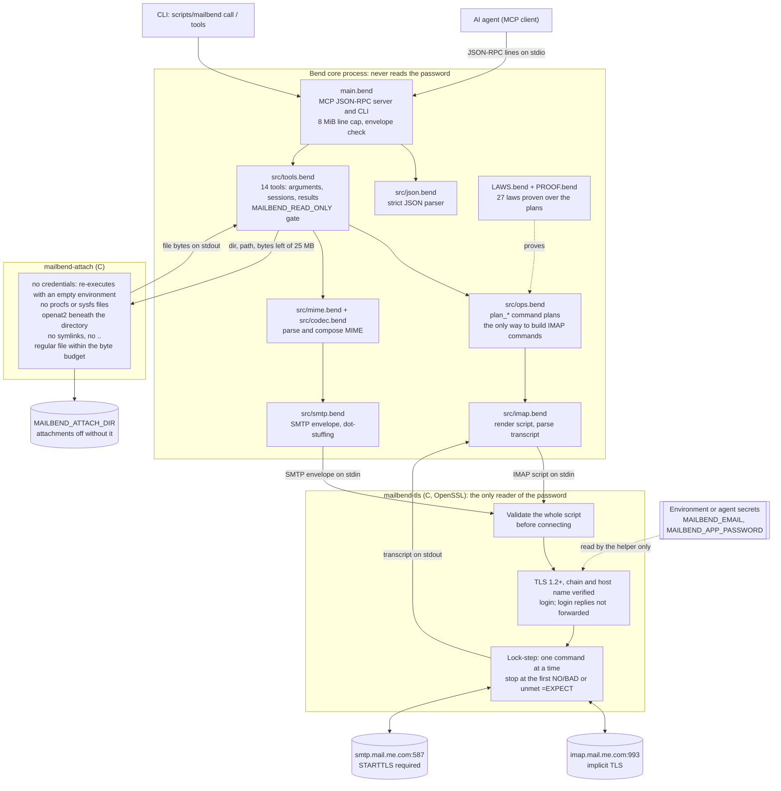
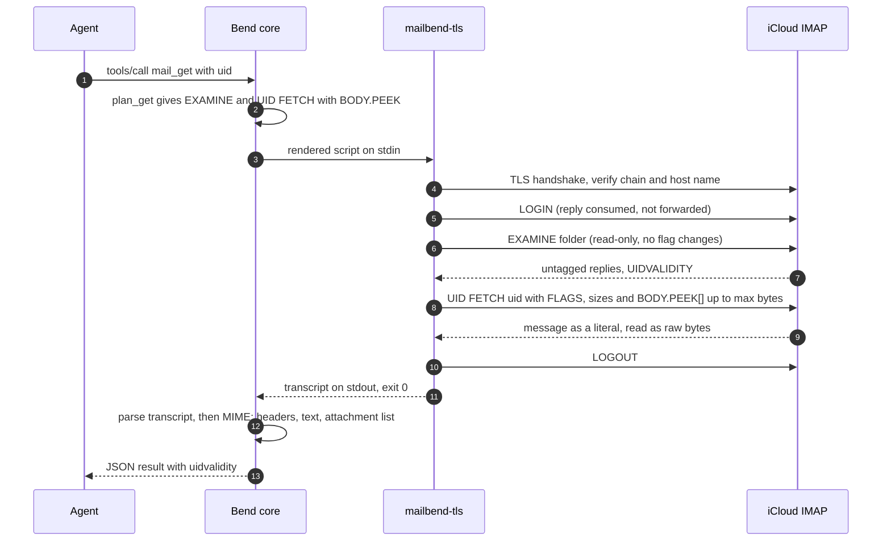
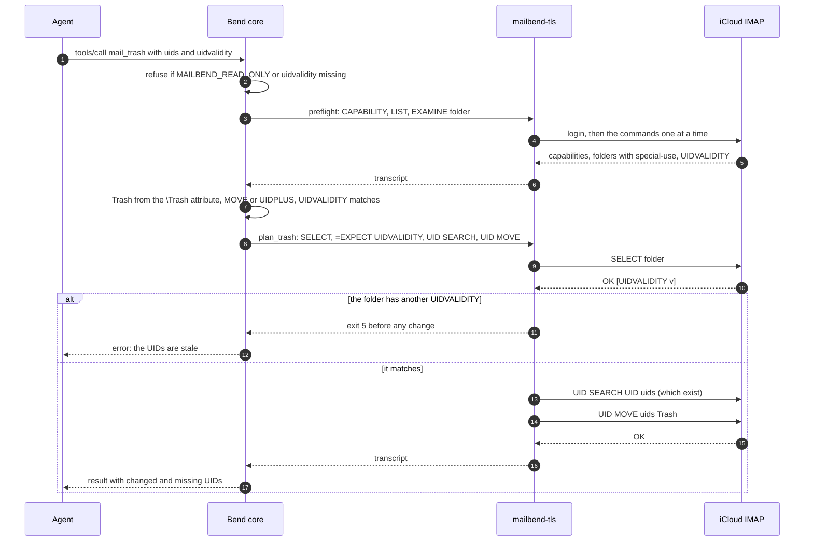

# Architecture

## Why IMAP + SMTP

iCloud Mail has no Gmail-style public REST API; it speaks standard mail
protocols. MailBend uses IMAP for mailboxes and SMTP for delivery:

- IMAP: `imap.mail.me.com:993`, implicit TLS
- SMTP: `smtp.mail.me.com:587`, STARTTLS
- login: the iCloud address and an Apple app-specific password

## Diagrams

### Components and trust boundaries

The Bend core decides everything (which commands run, how they are
rendered, what the replies mean). `mailbend-tls` is the only code that
touches the password and the network; `mailbend-attach`, which holds no
credentials, is the only code that opens attachment files.



The password is in the environment of both processes (the core starts the
helper, which inherits it), but only the helper reads it; see
[Credentials](#credentials).

### A read (mail_get)



### A change (mail_trash)

Every change runs two sessions: a read-only preflight, then the change
itself, pinned to the caller's UIDVALIDITY inside the changing session.



Without MOVE the plan copies, marks `\Deleted` and runs `UID EXPUNGE` of
exactly those UIDs, after `CAPABILITY` and `=EXPECT-WORD UIDPLUS` in the same
session; without UIDPLUS as well, there is no plan and nothing is sent.

### Where each safety rule is enforced

| Rule | Enforced in | Checked by |
| --- | --- | --- |
| TLS chain and host name always verified | `native/mailbend-tls.c` | transport tests (bad CA, wrong host, expired, self-signed) |
| Only the helper reads the password; no output contains it | helper (login, login replies not forwarded) | transport cases 2 and 18, e2e output scan |
| Reads never change mail (`EXAMINE`, `BODY.PEEK`) | `src/ops.bend` read plans | laws in `LAWS.bend`, e2e server log |
| Move and trash never expunge before copying | `plan_move`, `plan_trash` | laws `move/trash_never_loses_mail` |
| Delete needs `permanently-delete` and UIDPLUS | `plan_delete` | laws `delete_needs_confirmation`, `delete_checks_uidplus` |
| Stale UIDs never touch other messages | `=EXPECT` after `SELECT` in every change plan | laws `*_is_pinned`, e2e stale-UIDVALIDITY cases |
| No plain `EXPUNGE` | plans use `UID EXPUNGE` only | e2e server log |
| Attachments only from `MAILBEND_ATTACH_DIR`, at most 32 and 25 MB | `mailbend-attach` (openat2), `src/tools.bend` budget | e2e (symlink, `..`, `/proc/self/environ`, count, budget) |
| Message content cannot spoof a server reply | literals as raw bytes (helper and core) | transport and unit tests |
| Malformed MCP input is refused | `src/json.bend`, `main.bend` | unit tests, e2e MCP session |

## Layers

```text
main.bend            CLI (call/tools/mcp) and the MCP stdio server (JSON-RPC lines)
src/tools.bend       the 14 tools: arguments, sessions, results
src/ops.bend         operations and their IMAP command plans (the only way tools build commands)
src/imap.bend        command model, wire rendering, transcript parsing, modified UTF-7
src/mime.bend        message parsing (headers, RFC 2047/2231, multipart) and composition
src/smtp.bend        the SMTP envelope (dot-stuffing)
src/codec.bend       UTF-8, base64, quoted-printable, charsets
src/json.bend        JSON values, parser and serializer
src/schema.bend      MCP tool schemas (generated by tools/gen-schema.py)
native/mailbend-tls.c  verified TLS, login, lock-step command execution
native/mailbend-attach.c  safe attachment reads (no credentials)
LAWS.bend / PROOF.bend safety laws and their proofs
```

A tool call builds a plan (a list of IMAP commands) in `ops.bend`, renders it
to a script, and runs it through `mailbend-tls`, which logs in, sends the
commands one at a time, stops at the first rejection, logs out, and returns
the transcript. The core parses the transcript into results. Tools that need
server facts first (capabilities, special folders, the original of a reply)
run a short discovery session before the action session.

## Credentials

The core never reads `MAILBEND_APP_PASSWORD`; only the helper does. The
helper wipes its copies after login and does not forward the server's
login replies, so no transcript, tool result or log can contain the
password.

## Semantics

| Operation | Protocol |
| --- | --- |
| probe | `CAPABILITY` (after login) + `LIST "" "*"` |
| list folders | `CAPABILITY` + `LIST "" "*"`, special use from RFC 6154 attributes; when the server advertises SPECIAL-USE but marks nothing, a second session asks `LIST "" "*" RETURN (SPECIAL-USE)` |
| search | `EXAMINE` + `UID SEARCH` (`CHARSET UTF-8` with literals for non-ASCII) |
| message summaries | `EXAMINE` + `UID FETCH (UID FLAGS INTERNALDATE RFC822.SIZE BODY.PEEK[HEADER.FIELDS (...)])` |
| read | `EXAMINE` + `UID FETCH (... BODY.PEEK[]<0.max>)` |
| new mail | `EXAMINE` + `UID SEARCH UID n+1:*`, filtered to UIDs > n |
| (every change) | `SELECT`, `=EXPECT * OK [UIDVALIDITY v]` (checked by the helper), `UID SEARCH UID <uids>` (reports changed/missing) |
| mark read / unread | then `UID STORE +FLAGS.SILENT (\Seen)` / `-FLAGS.SILENT` |
| move | then `UID MOVE`; else (after `CAPABILITY` + `=EXPECT-WORD UIDPLUS` ahead of the guard) `UID COPY` + `UID STORE +FLAGS.SILENT (\Deleted)` + `UID EXPUNGE`; else refused |
| trash | move to the `\Trash` folder (by name only if the server marks no special-use folders) |
| delete | confirmation word, then `CAPABILITY` + `=EXPECT-WORD UIDPLUS`, the guard, `\Deleted` + `UID EXPUNGE` of exactly those UIDs; else refused |
| save draft | `APPEND` to the `\Drafts` folder with `(\Draft \Seen)` |
| send / reply / forward | MIME composition + SMTP via STARTTLS |

Notes:

- Capabilities are read after authentication, never assumed. IDLE is
  reported by `mail_probe` for a future watcher.
- Folders are IMAP mailboxes; names travel in modified UTF-7 and are shown
  decoded.
- Messages are addressed by UID. `mail_get_new` checkpoints on
  `folder + UIDVALIDITY + UID`, never on read/unread state; when UIDVALIDITY
  changes it reports `uidvalidity_changed` and restarts at 0.
- Composed messages are 7-bit: RFC 2047 encoded words for headers,
  quoted-printable text, base64 attachments. Bcc goes only into the envelope.
- A plain `EXPUNGE` is never sent: it would also remove messages another
  client marked `\Deleted`.
- Every change requires the folder's `uidvalidity` and is pinned to it in
  the changing session itself (`=EXPECT` after `SELECT`); move, trash and
  delete also run a read-only preflight (`CAPABILITY`, `LIST`, `EXAMINE`)
  for capabilities and folders.
- The core starts the helper only from an absolute `MAILBEND_TLS_HELPER`,
  never from a path relative to the working directory.
- Attachments come only from `MAILBEND_ATTACH_DIR` (at most 32, 25 MB in
  total, reading stops at the first failure), read by `mailbend-attach`
  (from an absolute `MAILBEND_ATTACH_HELPER`) with `openat2` beneath that
  directory (no symlinks,
  no `..`; the directory itself is opened by its canonical path without
  following symlinks) and checked on the opened descriptor.
- A `mail_get_new` checkpoint is a UID with its UIDVALIDITY: `since_uid`
  without `uidvalidity` is refused.
- Replies read the first 256 KB of the original. The result reports
  `quoted_original_truncated`, `quoted_bytes` and `original_bytes`, and a
  larger original also gets a note in the quote that it may be incomplete,
  so a partial quote is never mistaken for the whole message.
- Saved drafts keep a `Bcc:` header (a mail client sends them later); sent
  mail never carries one, Bcc goes only into the SMTP envelope.
- Every tool call (MCP or CLI) is checked against the tool's input schema
  first: a value of the wrong type, an unknown argument name or a missing
  required argument is refused, never read as absent or defaulted (so
  `"as_draft": "true"` cannot fall back to sending, nor a reply go out with
  no body).
- The MCP server accepts request lines up to 8 MiB and answers malformed
  JSON with `-32700`, a malformed JSON-RPC envelope with `-32600`, and
  tool `arguments` that are not an object with `-32602`.
- Search and new-mail fetch in a second session and require it to report
  the same UIDVALIDITY; reply and forward require the caller's
  `uidvalidity` to match the session that fetched the original.

## Safety laws

`LAWS.bend` states the invariants over the plans in `src/ops.bend`;
`PROOF.bend` proves them, and `bend PROOF.bend` fails if any stops holding:

- `Read`/`Search` are read-only, `Delete` is not, `Trash` is not destructive;
- the probe, preflight, folder, roles, search, summary, read and new-mail plans
  contain no command that can change a mailbox, for all arguments;
- rendered read scripts start with `EXAMINE`, and every fetch item renders as
  `BODY.PEEK[...]` or metadata;
- marking read/unread never marks `\Deleted` or expunges;
- move and trash never expunge before copying, for every capability set;
- delete is the empty plan unless the confirmation is exactly
  `permanently-delete` (the tool passes the caller's string straight in);
- saving a draft never removes anything;
- mark, move, trash and delete plans open with `SELECT` and the UIDVALIDITY
  expectation (or are empty);
- delete and copy-based move plans confirm UIDPLUS in their own session
  before anything else.

Fetch items are a closed type with no non-PEEK body item, so a read cannot
set `\Seen` by construction; the e2e suite also checks the server log.

## Transport boundary

See [native/README.md](../native/README.md) for the helper's contract: the
TLS rules, script format, output encoding, limits and exit codes.

The helper uses libcurl only for DNS and TCP connection setup, in connect-only
mode; it sends no mail commands through libcurl. System DNS is the default.
The cloud launcher opts into fresh DNS-over-HTTPS per helper process, while
OpenSSL still verifies the original mail hostname and owns mail TLS. Numeric
connection overrides likewise never change SNI or the certificate identity.
No DNS result is stored on disk or in the long-running Bend MCP core. See the
[cloud recovery guide](CLOUD_AGENT.md) for resolver configuration and rebuilds.

## Bend notes

Bend 2 (2.0.29) is total by default: no mutual recursion, recursion must
shrink an argument, and `match` only inspects parameters. Parsers are
therefore char-by-char state machines (structural on the input) feeding
explicit stacks. The MCP read loop is the one `@unsafe` def, as in Bend's own
server demos, since its length is set by the client. Running `bend main.bend`
checks and compiles on every start (~9 s); `scripts/install.sh` compiles a
native binary once (~1 min) that starts in milliseconds.
