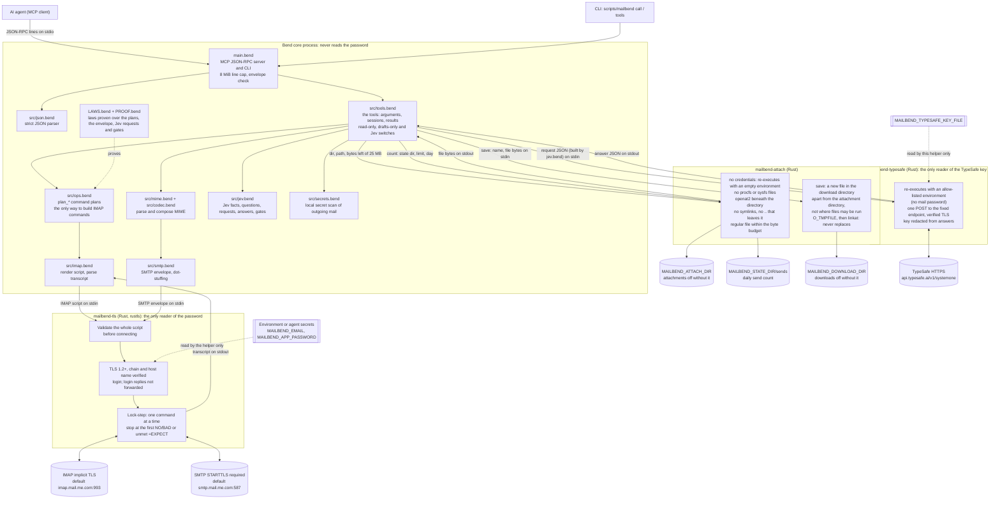
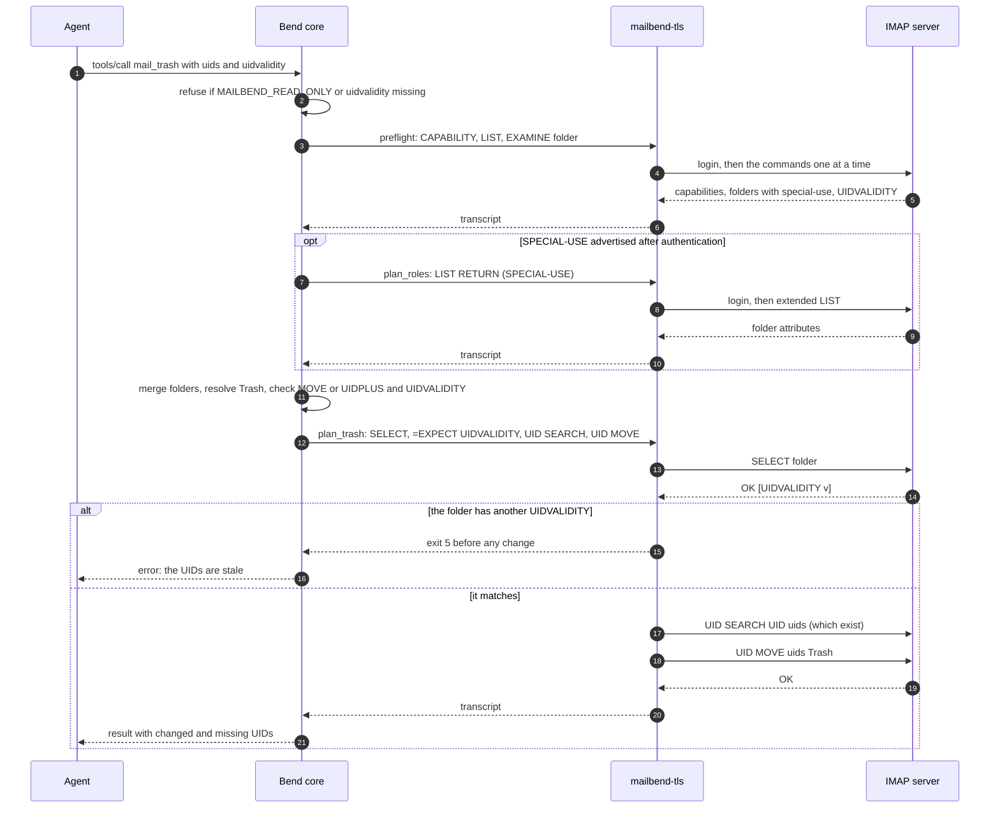
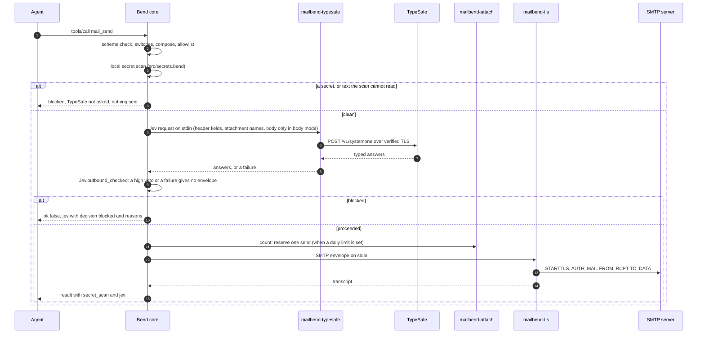

# Architecture

## Why IMAP + SMTP

MailBend uses password-authenticated IMAP for mailboxes and SMTP for delivery.
iCloud Mail is the default and live-tested profile:

- IMAP: `imap.mail.me.com:993`, implicit TLS
- SMTP: `smtp.mail.me.com:587`, STARTTLS
- login: the iCloud address and an Apple app-specific password

Other compatible providers use the same architecture with configured IMAP
and SMTP hosts and ports. IMAP requires implicit TLS and SMTP requires
STARTTLS; OAuth and implicit SMTPS are unsupported. Other providers have not
been live-tested here. Live iCloud results are in
[CLOUD_AGENT.md](CLOUD_AGENT.md#live-icloud-record).

## Diagrams

### Components and trust boundaries

The Bend core decides everything (which commands run, how they are
rendered, what the replies mean). `mailbend-tls` is the only code that
touches the password and the mail servers; `mailbend-attach`, which holds no
credentials, is the only code that opens attachment files, writes downloaded
attachments or opens the send counter; `mailbend-typesafe`, which never holds
the password, is the only code that reads the TypeSafe key and reaches
TypeSafe.



The password is in the environment of both processes (the core starts the
helper, which inherits it), but only the helper reads it; see
[Credentials](#credentials).

### A read (mail_get)


### A change (mail_trash)

Changes to existing messages are pinned to the caller's UIDVALIDITY inside
the changing session. Move, trash and delete first run a read-only preflight
for server capabilities and folders; the diagram shows trash with MOVE.



Without MOVE the plan copies, marks `\Deleted` and runs `UID EXPUNGE` of
exactly those UIDs, after `CAPABILITY` and `=EXPECT-WORD UIDPLUS` in the same
session; without UIDPLUS as well, there is no plan and nothing is sent.

### A send with Jev on (mail_send)

A send passes the allowlist, the local secret scan and Jev's vetoes before
its envelope exists; a delete passes the same kind of gate
(`Jev.delete_checked`) before its plan exists. With Jev off, the scan and
the request are skipped and the envelope is the allowlist's.



Reads with Jev on fetch first, then ask once and add each message's `jev`
notes; a TypeSafe failure leaves the read working, marked `unchecked`.

### Where each safety rule is enforced

| Rule | Enforced in | Checked by |
| --- | --- | --- |
| TLS chain and host name always verified | `native/mailbend-net/src/tls.rs` (rustls) | transport tests (bad CA, wrong host, expired, self-signed) |
| Only the helper reads the password; no output contains it | helper (login, login replies not forwarded) | transport cases 2 and 18, e2e output scan |
| Reads never change mail (`EXAMINE`, `BODY.PEEK`) | `src/ops.bend` read plans | laws in `LAWS.bend`, e2e server log |
| Move and trash never expunge before copying; the first `UID EXPUNGE` names the first `UID COPY`'s UIDs | `plan_move`, `plan_trash` | laws `move/trash_never_loses_mail`, `move/trash_expunges_only_copied` (labels: `label_is_move`) |
| Flagging changes exactly `\Flagged` and, for a colour, its three bits (a closed set, one pure colour-to-bits mapping), never `\Deleted` or an expunge; unflagging clears all of them; `colour_kept` is `true` only with every changed message's reported flags and PERMANENTFLAGS as evidence | `plan_flag`, `plan_unflag`, `colour_bits`, `colour_kvs` | laws `flag_never_deletes`, `flag_changes_only_flag_and_colour`, `flag_changes_exactly`, `unflag_clears_flag_and_colour`, unit test per colour, e2e kept / session-only / dropped / unverified cases |
| A label is a move, and creating or renaming a folder touches no message; a rename moves each subscription, subscribing new names before unsubscribing old ones | `plan_label` is `plan_move`; `plan_create`, `plan_rename`, the read-only folder scan before them | laws `label_is_move`, `label_creates_no_folder`, `create/rename_changes_exactly`, `create/rename_changes_no_mail`, `rename_subscribes_each_moved_folder`, `rename_unsubscribes_each_moved_folder`, `rename_subscribes_before_unsubscribing`, `folder_plans_destroy_nothing`, `folder_scan_writes_nothing` |
| Folder tools never touch INBOX, role folders or `To Delete`, nest under no missing parent, and fail closed when the delimiter is unknown; `inbox/` is written as the listed INBOX; only `mail_triage` moves mail into `To Delete` or a folder inside it, `mail_move` and `mail_label` may move mail out of it but `mail_trash` may not, and no role override may name it or a folder inside it | `src/tools.bend` `*_problem`, `canonical_name`, `review_move_problem`, `review_trash_problem`, `invalid_override` | e2e `folder_*` cases (both delimiters) and `triage_protections` cases |
| A move cut off after its COPY may have run is `partial`, never an error implying nothing changed | `src/tools.bend` `interrupted`, `Out.Partial` | e2e interrupted-label cases, MCP `isError` case |
| A flag change stopped once a store was acknowledged or sent unanswered is `partial`, listing the acknowledged and possibly-run changes; one whose search found no UID, or that stopped before any store, is a plain error | `src/tools.bend` `flag_cut`, `store_changes` | e2e refused, cut-off, absent-UID, unflag-cleanup and read-back cases |
| A helper that never started changed nothing; one that failed after starting, or was killed by a signal, may have (one classifier for flag changes, COPY-based moves and folder changes) | `src/tools.bend` `proc_of` (`ProcRefused` for the path refusal and spawn errnos), `helper_lost` | e2e relative, missing and killed helper cases |
| Delete needs `permanently-delete` and UIDPLUS; the first `UID EXPUNGE` names the first `\Deleted` store's UIDs | `plan_delete` | laws `delete_needs_confirmation`, `delete_checks_uidplus`, `delete_expunges_only_marked`, `delete_expunges_given_uids` |
| Stale UIDs never touch other messages | `=EXPECT` of the caller's UIDVALIDITY after `SELECT` in every change plan | laws `*_is_pinned`, `*_pins_callers_uidvalidity`, e2e stale-UIDVALIDITY cases |
| No plain `EXPUNGE` | plans use `UID EXPUNGE` only | law `expunge_renders_uid_expunge`, e2e server log |
| Read-only mode refuses and hides every tool that changes mail; drafts-only mode refuses every send; `mail_classify` and `mail_triage` are refused and hidden unless `MAILBEND_TYPESAFE` is on; unclear switch values fail | `src/tools.bend` (`config`, `gated`, `offered_tools`), `Ops.listed` | laws `read_only_tools_are_exactly_seven`, `tools_listed_per_config`, e2e (every mutating tool, `mail_triage` in read-only mode, switch values, tool lists with Jev off and on) |
| The TypeSafe key never shares a process with the mail password: it is read only from `MAILBEND_TYPESAFE_KEY_FILE` by `mailbend-typesafe`, which re-executes with an allow-listed environment; `MAILBEND_TYPESAFE_API_KEY` set fails every tool; the key is redacted from answers | `native/mailbend-typesafe` (`environment`, `settings`, `api`), `mailbend-io` `secret`, `config` in `src/tools.bend`, `mailbend-tls` refusal | Rust tests (allow-list, redaction, exit codes), e2e (`/proc/<pid>/environ` of the helper, key in the environment, echoed key, output scan) |
| Jev gets header facts and attachment names, and message text only with `MAILBEND_TYPESAFE_CONTENT=body` and `MAILBEND_TYPESAFE_ZERO_RETENTION=1`; `mail_classify` changes nothing and creates no folder | `src/jev.bend` (`state_of`), `plan_classify` (`EXAMINE`, `BODY.PEEK`, `BODYSTRUCTURE`) | laws `headers_state_has_no_body`, `classify_writes_nothing`, `fetch_items_never_set_seen`; unit tests; e2e recorded requests, server log and state |
| Triage moves each message at most once, only into `To Delete` or an existing category folder it was given (never INBOX, a role folder or the source folder), creates no folder, and expunges only what it copied; it moves nothing unless every Jev request succeeded; `To Delete` needs a body-mode message with its whole text, no code veto (flagged or answered, read again just before the moves; attachments; under 30 days old; a sender with one From field whom the user never wrote to in To or Cc) and Jev's low keep answers and high disposability, asked in a request of its own | `Jev.verdict`, `Jev.filing`, `Ops.plan_triage` (guards its own destinations and repeats; the laws restate both independently), `t_triage` | laws `triage_moves_only_to_known_folders`, `triage_creates_no_mailbox`, `triage_one_move_per_message`, `triage_expunges_only_moved`, `filing_matches_table`, `uncertain_changes_nothing`, `sent_search_writes_nothing`, `reread_flags_writes_nothing`; unit tests over every band, verdict and category; e2e per table row with and without MOVE, a Cc-only correspondent, two From fields, a message flagged during the call |
| A missing or malformed Jev answer reads as the cautious one; a refused request is split once, any other failure stops the call | `src/jev.bend` (bands, picks), `ask_batch` in `src/tools.bend` | law `missing_answer_is_cautious`, unit tests, e2e against `tests/fake_typesafe.py` (401, 422, 429, 529, timeout, malformed, split, later-batch failure) |
| With Jev on, a send passes a local secret scan (private-key blocks, well-known token prefixes, password lines, also when quoted; header fields, text parts and the header sections of attached or forwarded messages, decoded, then every other part's bytes best effort; at most 1 MB of text, 3 levels of forwarded messages, 8 of multipart nesting and 10,000 parts, any text it cannot read, a NUL included, blocking) and then Jev's veto questions; a delete needs UIDPLUS, passes the keep questions and plans only the UIDs Jev was asked about; a gate only takes the action away (the allowlist's envelope or the delete plan unchanged, or none), and TypeSafe failing blocks it; drafts are never gated | `Secrets.secret_scan` in `src/secrets.bend`; `Jev.outbound_checked`, `Jev.delete_checked` in `src/jev.bend`; `send_gated`, `delete_gated` in `src/tools.bend` | laws `send_veto_only_subtracts`, `delete_veto_only_subtracts`, `failure_blocks_outbound`, `secret_scan_blocks`, `outgoing_headers_state_has_no_body` (the pure wrappers only); CI check, on the code flattened to one line, that `S.outbound` is called only in `src/jev.bend`, `smtp_run` only once, `plan_delete` only through `delete_checked`, and no expunge is made outside `src/ops.bend` and `src/imap.bend`; unit tests (true and false positives, encodings, nesting, binary parts, the 1 MB bound); e2e (scan cases, recorded headers-mode requests, vetoes, TypeSafe down, dry runs, a UID taken during a delete) |
| With Jev on, the four reads add a `jev` object to each message (`suspected_injection` only when suspected), asking TypeSafe once without retries; TypeSafe failing leaves the read working, each message `unchecked` | `annotated` in `src/tools.bend`, `Jev.annotation_jsons` | unit tests, e2e (every read, headers-mode requests, TypeSafe down) |
| With an allowlist, a message goes only when every envelope recipient is allowed; the envelope has no other source | `S.outbound` in `src/smtp.bend`, `send_with` in `src/tools.bend` | laws `allowlist_refuses_unlisted`, `no_allowlist_is_unchanged`, CI grep for other envelope callers, unit and e2e allowlist cases |
| The daily send limit is reserved before SMTP and fails closed; no tool reads or changes the count | `mailbend-attach count` (`flock`, openat2), `reserve` in `src/tools.bend` | Rust tests (two concurrent processes), e2e at, below and over the limit |
| A Sent copy is one `APPEND` to the resolved Sent folder, made only when a read-only search finds no copy; a failed copy does not fail the send | `plan_sent_copy`, `sent_copy` in `src/tools.bend` | law `sent_copy_only_appends`, e2e with and without server filing |
| Malformed send settings refuse every send, never read as off | `src/tools.bend` `sending_of` | unit and e2e cases |
| Attachments only from a dedicated `MAILBEND_ATTACH_DIR`, at most 32 and 25 MB | `mailbend-attach` (openat2, broad-directory and hard-link refusal, O_PATH type check), `src/tools.bend` budget | e2e (symlink, `..`, `/proc/self/environ`, `/`, home, `.ssh`, hard link, FIFO, count, budget) |
| Downloads are new files (mode 0600, never replacing one) only in a dedicated `MAILBEND_DOWNLOAD_DIR`, apart from `MAILBEND_ATTACH_DIR` and from directories whose files may be run; never in read-only mode | `mailbend-attach save` (`O_TMPFILE` + `linkat`, device and inode lineage, `PATH` entries), `local_name` in `src/mime.bend`, law `download_is_not_read_only` | Rust tests, e2e (every byte, existing file, names, overlap and alias, `~/.config`, `autostart`, `.ssh`, `PATH` and alias, killed helper, truncated fetch) |
| Message content cannot spoof a server reply | literals as raw bytes (helper and core) | transport and unit tests |
| Malformed MCP input is refused | `src/json.bend`, `main.bend` | unit tests, e2e MCP session |
| A thread holds only messages whose Message-ID, In-Reply-To or References name one of the IDs searched for, compared exactly after the substring `SEARCH HEADER`; never grouped by subject; at most two rounds | `src/thread.bend` (`is_linked`, `next_ids`, `thread_order`), `plan_thread_search`, `plan_thread_headers` | law `thread_plans_write_nothing`, unit tests (order, missing parents, cycles, shared IDs, long References), e2e case-only match, deleted reply, two-round bound, long References |
| A dry run (`dry_run: true`) runs only the read-only checks the tool makes (the flag tools make none), then shows the IMAP lines, the SMTP sender, recipients and `sent_copy` intent, or file it would use, with messages and files as `<N bytes>`; it reserves no send and does not check the daily limit, saves no file and is refused in read-only mode | `preview_or_run` in `src/tools.bend` (every tool that is not read-only), `I.preview` | law `append_preview_hides_message`, unit tests, e2e (every such tool: server state and log, download directory, send counter, `mailbend-attach` calls; every tool listed as not read-only has a `dry_run` argument, with Jev off and on) |
| Folder roles resolve independently; uncertain targets never trigger guessed writes | `src/tools.bend` discovery and resolution, `src/ops.bend` discovery plans | local e2e partial-role, override, ambiguity and failed-discovery cases |

## Layers

```text
main.bend            CLI (call/tools/mcp) and the MCP stdio server (JSON-RPC lines)
src/tools.bend       the tools: arguments, sessions, results
src/jev.bend         Jev (TypeSafe's model): message facts, questions, requests, typed
                     answers, the triage verdict, the filing table and the gates
src/secrets.bend     the local secret scan of an outgoing message
src/thread.bend      which messages form a thread, and their order and parents
src/ops.bend         operations and their IMAP command plans (the only way tools build commands)
src/imap.bend        command model, wire rendering, transcript parsing, modified UTF-7
src/mime.bend        message parsing (headers, RFC 2047/2231, multipart) and composition
src/smtp.bend        the SMTP envelope (dot-stuffing) and the recipient allowlist
src/codec.bend       UTF-8, base64, quoted-printable, charsets
src/json.bend        JSON values, parser and serialiser
src/schema.bend      MCP tool schemas (generated by tools/gen-schema.py)
LAWS.bend / PROOF.bend safety laws and their proofs
native/              the Rust helpers (native/README.md):
  mailbend-tls/        verified TLS, login, lock-step command execution
  mailbend-attach/     attachment reads and downloads, the send counter (no credentials)
  mailbend-typesafe/   the TypeSafe request, with the key from its file (no mail password)
  mailbend-net/, mailbend-io/, fuzz/
                       shared network and file code, parser fuzzing
```

A tool call builds a plan (a list of IMAP commands) in `ops.bend`, renders it
to a script, and runs it through `mailbend-tls`, which logs in, sends the
commands one at a time, stops at the first rejection, logs out, and returns
the transcript. The core parses the transcript into results. Tools that need
server facts first (capabilities, role folders, the original of a reply)
run a short discovery session before the action session.

## Credentials

The core never reads `MAILBEND_APP_PASSWORD`; only the helper does. The
helper wipes its copies after login and does not forward the server's
login replies, so no transcript, tool result or log can contain the
password. An environment variable is still inherited by the core and
readable by any process of the same user; with `MAILBEND_PASSWORD_FILE`
(absolute, a regular file owned by the user, mode 600, no symlink in any
path component) the
helper reads the password from that file instead, and it is in no
environment. Setting both is refused.

## Semantics

| Operation | Protocol |
| --- | --- |
| probe / list folders | `CAPABILITY` (after login) + `LIST "" "*"`; when SPECIAL-USE is advertised, a second discovery session requests `LIST "" "*" RETURN (SPECIAL-USE)`, even if ordinary LIST already marks some roles |
| search | `EXAMINE` + `UID SEARCH` (`CHARSET UTF-8` with literals for non-ASCII) |
| message summaries | `EXAMINE` + `UID FETCH (UID FLAGS INTERNALDATE RFC822.SIZE BODY.PEEK[HEADER.FIELDS (...)])` |
| read | `EXAMINE` + `UID FETCH (... BODY.PEEK[]<0.max>)` |
| new mail | `EXAMINE` + `UID SEARCH UID n+1:*`, filtered to UIDs > n |
| changes to existing messages | `SELECT`, `=EXPECT * OK [UIDVALIDITY v]` (checked by the helper), `UID SEARCH UID <uids>` (reports changed/missing) |
| mark read / unread | then `UID STORE +FLAGS.SILENT (\Seen)` / `-FLAGS.SILENT` |
| flag / unflag | then `UID STORE +FLAGS.SILENT (\Flagged)`; with a colour, one `UID STORE` per `$MailFlagBit0..2`, adding the bits of its index and removing the others (red has none); without one, no bit store. Unflag removes `\Flagged`, then all three bits. Then `UID FETCH (UID FLAGS)`: its own replies (the last with FLAGS per UID; none without a UID) are the reported flags, judged for a colour with SELECT's `PERMANENTFLAGS` (`colour_kept`, `colour_not_kept`) |
| move | then `UID MOVE`; else (after `CAPABILITY` + `=EXPECT-WORD UIDPLUS` ahead of the guard) `UID COPY` + `UID STORE +FLAGS.SILENT (\Deleted)` + `UID EXPUNGE`; else refused |
| trash | move to the resolved Trash folder using the per-role policy below |
| label | the move plan, into an existing folder that is none of the protected ones |
| create folder | `CAPABILITY`, `CREATE`, `SUBSCRIBE`, after a discovery session (`CAPABILITY`, `LIST`, `LSUB`) |
| rename folder | `CAPABILITY`, `RENAME`, a `SUBSCRIBE` of the new name of each moved folder that was subscribed, then an `UNSUBSCRIBE` of each old name |
| delete | confirmation word, then `CAPABILITY` + `=EXPECT-WORD UIDPLUS`, the guard, `\Deleted` + `UID EXPUNGE` of exactly those UIDs; else refused |
| save draft / reply-as-draft / forward-as-draft | `APPEND` to the resolved Drafts folder with `(\Draft \Seen)` |
| send / reply / forward | MIME composition + SMTP via STARTTLS |
| classify | `CAPABILITY` + `LIST` (the folders to choose among), then `EXAMINE` + `UID FETCH (UID FLAGS INTERNALDATE RFC822.SIZE BODY.PEEK[HEADER.FIELDS (...)] BODYSTRUCTURE)`, with `BODY.PEEK[]<0.max>` too in body mode; then requests to TypeSafe through `mailbend-typesafe` |
| triage | as classify, plus read-only searches of Sent for mail to each candidate's sender and a second read of the candidates' flags; then one move plan per destination folder |

### Folder discovery and resolution

The Bend core merges ordinary and extended LIST entries by decoded mailbox
identity, preserving ordinary entries and their attributes. A failed extended
LIST remains an error; it never permits fallback to guessed folder names.
The TLS helper only executes the core's discovery plans.

Each role then resolves independently, by the precedence, overrides and
conventional names in the [README](../README.md#configure). There is no
substring matching, namespace guessing or mailbox creation. Resolving Sent
does not append sent mail there: SMTP delivery and provider filing are
separate.

Local e2e tests exercise partial metadata, extended discovery, all three
draft paths, advertised-role precedence, localised/nested overrides and
refusal of ambiguous, missing, unselectable or failed-discovery targets.
These tests use the fake TLS server, not a live provider.

### Other protocol details

- Capabilities are read after authentication, never assumed. IDLE is
  reported by `mail_probe` for a future watcher.
- Folders are IMAP mailboxes; names travel in modified UTF-7 and are shown
  decoded.
- Messages are addressed by UID. `mail_get_new` checkpoints on
  `folder + UIDVALIDITY + UID`, never on read/unread state; when UIDVALIDITY
  changes it reports `uidvalidity_changed` and restarts at 0.
- Composed messages are 7-bit: RFC 2047 encoded words for headers,
  quoted-printable text, base64 attachments. For SMTP-sent messages, Bcc goes
  only into the envelope; saved drafts retain the header.
- A plain `EXPUNGE` is never sent: it would also remove messages another
  client marked `\Deleted`.
- Changes to existing messages require the folder's `uidvalidity` and are
  pinned to it in the changing session itself (`=EXPECT` after `SELECT`); move, trash and
  delete also run a read-only preflight (`CAPABILITY`, `LIST`, `EXAMINE`)
  for capabilities and folders.
- The core starts the helper only from an absolute `MAILBEND_TLS_HELPER`,
  never from a path relative to the working directory.
- Attachments come only from `MAILBEND_ATTACH_DIR` (at most 32, 25 MB in
  total, reading stops at the first failure), read by `mailbend-attach`
  (from an absolute `MAILBEND_ATTACH_HELPER`) with `openat2` beneath that
  directory (no symlinks,
  no `..` that leaves it; the directory itself is opened by its canonical path without
  following symlinks) and checked on the opened descriptor. The directory
  must be dedicated: `/`, the home directory or one containing it, and one
  holding `.ssh`, `.gnupg`, `.aws`, `.config` or `.git`, or that is or lies
  inside a directory so named, are refused, as are
  files with a second hard link, devices and FIFOs.
- `mail_get_attachment` reads the message as `mail_get` does and refuses one
  larger than 25 MB, by its reported size or because its body fills the
  25 MB fetch, rather than save part of it. `mailbend-attach save`
  writes into `MAILBEND_DOWNLOAD_DIR`, which it refuses on the same grounds
  as `MAILBEND_ATTACH_DIR`, when it is, contains or lies inside
  `MAILBEND_ATTACH_DIR`, or when its files may be run (see
  the **Downloads** item in [native/README.md](../native/README.md#contract)). `PATH` reaches it as
  an argument, because the helper drops its environment.
- A `mail_get_new` checkpoint is a UID with its UIDVALIDITY: `since_uid`
  without `uidvalidity` is refused.
- `mail_get_thread` searches the message's folder, INBOX and the resolved
  Sent folder (each once; Sent is left out when it does not resolve) for
  the IDs the thread names (`UID SEARCH HEADER ... UNDELETED`, one session
  for every folder), fetches the summaries of the new UIDs, and keeps a
  message only when its own ID, In-Reply-To or References name one of those
  IDs exactly. It runs two such rounds at most, 50 IDs each, and only the
  last 50 References of a message count, so a long header costs no more.
  An ID that is not plain ASCII or is longer than 998 bytes is not searched
  for, so that no server refuses a search. The read fails when a folder's
  UIDVALIDITY changes between its sessions. Messages are ordered by
  INTERNALDATE (set by the server) and then UID; a message's parent is the
  one its In-Reply-To names, else the last one its References names. A
  cycle of parents in broken headers is cut at its newest message, and a
  message whose Message-ID another message also has gets no parent.
- Replies read the first 256 KB of the original. The result reports
  `quoted_original_truncated`, `quoted_bytes` and `original_bytes`, and a
  larger original also gets a note in the quote that it may be incomplete,
  so a partial quote is never mistaken for the whole message.
- Saved drafts keep a `Bcc:` header (a mail client sends them later); sent
  mail never carries one, Bcc goes only into the SMTP envelope.
- Every tool call (MCP or CLI) is checked against the tool's input schema
  first: a value of the wrong type, an unknown argument name, an argument
  given more than once or a missing required argument is refused, never read
  as absent or defaulted (so `"as_draft": "true"` cannot fall back to
  sending, nor a reply go out with no body, and `"dry_run": false, "dry_run":
  true` cannot run for real while a client that keeps the last member reads
  a dry run).
- The MCP server accepts request lines up to 8 MiB and answers malformed
  JSON with `-32700`, a malformed JSON-RPC envelope with `-32600`, and
  tool `arguments` that are not an object with `-32602`.
- Search and new-mail fetch in a second session and require it to report
  the same UIDVALIDITY; reply and forward require the caller's
  `uidvalidity` to match the session that fetched the original.

## Safety laws

`LAWS.bend` states the invariants and `PROOF.bend` proves them;
`bend PROOF.bend` fails if any stops holding. The
[enforcement table](#where-each-safety-rule-is-enforced) names the laws
behind each rule, and
[What the proofs cover](../README.md#what-the-proofs-cover) says what they
leave to tests.

Fetch items are a closed type with no non-PEEK body item, so a read cannot
set `\Seen` by construction; the e2e suite also checks the server log.

## Transport boundary

See [native/README.md](../native/README.md) for the helper's contract: the
TLS rules, script format, output encoding, limits and exit codes.

System DNS is the default. The cloud launcher opts into fresh
DNS-over-HTTPS per helper process (the helper's own client in
`native/mailbend-net/`), while rustls still verifies the original mail
hostname and owns mail TLS. Numeric
connection overrides likewise never change SNI or the certificate identity.
No DNS result is stored on disk or in the long-running Bend MCP core. See the
[cloud recovery guide](CLOUD_AGENT.md) for resolver configuration and rebuilds.

## Bend notes

Bend 2 is total by default: no mutual recursion, recursion must
shrink an argument, and `match` only inspects parameters. Parsers are
therefore char-by-char state machines (structural on the input) feeding
explicit stacks. The MCP read loop and its supporting loop helpers use
`@unsafe`, as in Bend's own server demos, because the client determines the
session length. Running `bend main.bend`
checks and compiles on every start (~9 s); `scripts/install.sh` compiles a
native binary once (~1 min) that starts in milliseconds.
