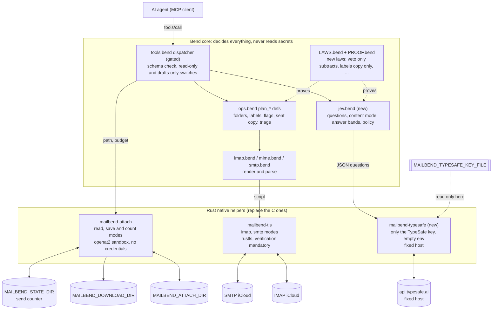
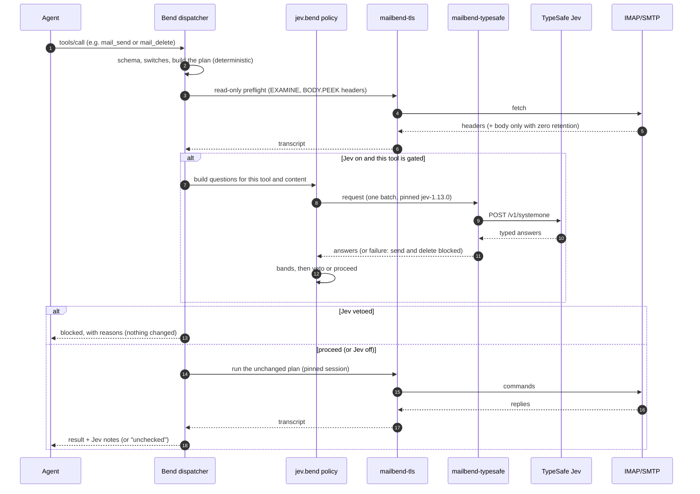
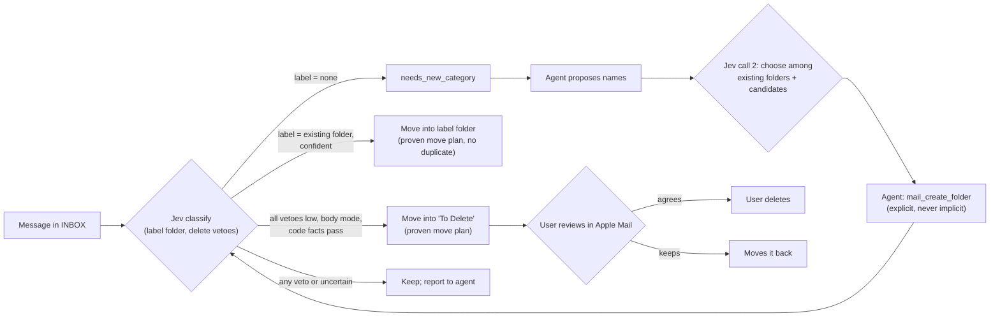
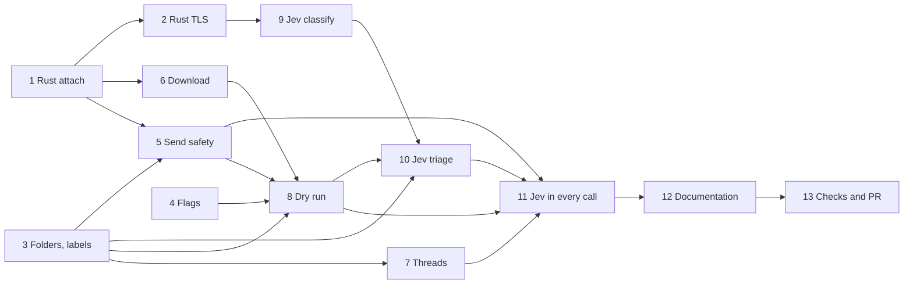

# MailBend: labels, Jev decisions, and Rust helpers

## Overview

Delivers the accepted brainstorm
([brainstorm report](../reports/brainstorm-261005-1855-mailbend-next-features.md)):
labels as iCloud folders (a move, no duplicates), flag colours, Sent copies with a recipient
allowlist and send limit, attachment download, threads, dry-run previews,
TypeSafe Jev consulted inside the tool calls where it helps (veto before outbound and irreversible actions, annotations on mail content), and
both native helpers rewritten in Rust with an unchanged contract. The user
runs the live iCloud checks once the PR is ready.

Scope mode: HOLD SCOPE (no `--yagni`). Evidence rules: every claim cites a
file and line, a primary doc, or is marked unverified and turned into a
check.

## Settled decisions

| Decision | Source |
| --- | --- |
| A label is an iCloud folder: `mail_label` moves the message there (no duplicate copies); removing a label is a move back to INBOX; there is no unlabel or labels-of tool | user, after the review PR opened (replaces the earlier copy-based labels) |
| Jev's category is the label: triage moves each message into one existing folder; when none fits, the agent proposes names and Jev chooses in a second call; a new folder exists only via `mail_create_folder` | user, after the review PR opened |
| `mail_create_folder` is the only way a mailbox is created; AGENTS.md rule reworded | user, brainstorm section 7 |
| Jev never deletes; a safe verdict moves mail into a "To Delete" review folder | user, brainstorm section 7 |
| Bodies go to TypeSafe only with `MAILBEND_TYPESAFE_ZERO_RETENTION=1`; headers by default | user, brainstorm section 2 |
| Tiered Jev (when `MAILBEND_TYPESAFE=1` and a key is set): veto before send/reply/forward and permanent delete; annotations on get, search, new mail, threads; classify and triage tools; no Jev on reversible or content-free calls. Jev can only veto or annotate | user, after [Jev gating research](./research/researcher-jev-gating-evidence.md) |
| A separate `mailbend-typesafe` helper calls TypeSafe with a key read only from `MAILBEND_TYPESAFE_KEY_FILE`; a key in the environment is a configuration error, so the key never reaches the core or `mailbend-tls` | user, this session; red team |
| The daily send limit is a local counter file kept by `mailbend-attach count`, reserved before sending; no tool can change it | user, red-team round |
| `mail_get_attachment` is not a read tool: refused and hidden in read-only mode | user, red-team round |
| One PR for all phases; no MCP registry `server.json` now | user, red-team round |
| TypeSafe unreachable: block send, reply, forward and permanent delete; reads continue marked "unchecked" | user, this session |
| Both helpers rewritten in Rust; all related docs updated | user, brainstorm section 8 |

## Components

## Workflow: one tool call with Jev

Gated before the change: send, reply, forward (a local secret check in Bend
plus Jev on headers and recipients; the body only in body mode), permanent
delete (blocked only when a veto scores high). For
`mail_get` (full) and search, new mail and threads (headers only) the order
is fetch, then Jev on the fetched content, then the result with a `jev`
object (reply_needed, priority, category, suggested_action, and
suspected_injection only when flagged). Flags, labels, folders, move, trash,
drafts and downloads do not call Jev. Laws prove that the pure decision
functions the tools must call (`outbound_checked`, `delete_checked`) return
the plan without Jev or nothing; that the IO code calls only them is covered
by end-to-end tests and a CI grep, not by a proof.

## Workflow: labels (folders) and the "To Delete" review

## Phase dependencies

## Phases

| # | Phase | Effort | Status |
|---|-------|--------|--------|
| 1 | [Rust workspace and attachment reader](./phase-01-rust-workspace-and-attachment-reader.md) | 1d | Pending |
| 2 | [Rust TLS helper](./phase-02-rust-tls-helper.md) | 3d | Pending |
| 3 | [Folders and labels](./phase-03-folders-and-labels.md) | 2.5d | Pending |
| 4 | [Flags and colours](./phase-04-flags-and-colours.md) | 0.5d | Pending |
| 5 | [Send safety](./phase-05-send-safety.md) | 2d | Pending |
| 6 | [Attachment download](./phase-06-attachment-download.md) | 1.5d | Pending |
| 7 | [Threads](./phase-07-threads.md) | 1d | Pending |
| 8 | [Dry-run preview](./phase-08-dry-run-preview.md) | 0.5d | Pending |
| 9 | [Jev foundation and classify](./phase-09-jev-foundation-and-classify.md) | 2.5d | Pending |
| 10 | [Jev triage and delete review](./phase-10-jev-triage-and-delete-review.md) | 1.5d | Pending |
| 11 | [Jev decision gates](./phase-11-jev-decision-gates.md) | 2d | Pending |
| 12 | [Documentation update](./phase-12-documentation-update.md) | 1d | Pending |
| 13 | [Release checks and PR](./phase-13-release-checks-and-pr.md) | 0.5d | Pending |

## Success criteria

- [ ] `bend PROOF.bend` prints "ALL PROOFS CHECK" with every new law listed in each phase.
- [ ] `sh tests/run-unit.sh`, `bash tests/test-transport.sh`, `python3 tests/test-cloud-network.py`, `scripts/install.sh && python3 tests/test-e2e.py` pass against the Rust helpers, with test edits limited to the build line in `tests/test-transport.sh:36` and the documented tool-count and tool-list updates.
- [ ] CI adds cargo fmt, clippy, test, deny, an MSRV check, the `dangerous()` grep and a fuzz smoke run, all green.
- [ ] With `MAILBEND_TYPESAFE` unset, every existing e2e behaviour assertion passes (only the tool-count and tool-list assertions change).
- [ ] Every new or changed law is listed verbatim in the PR for the user's review.
- [ ] README, ARCHITECTURE, native/README, AGENTS, CONTRIBUTING, CLOUD_AGENT and .env.example describe the new behaviour.
- [ ] A live iCloud checklist is in `docs/CLOUD_AGENT.md` for the user to run on the PR.

## Red Team Review

### Session — 2026-10-05
**Findings:** 15 (15 accepted, 0 rejected; one reviewer line citation, `docs/CLOUD_AGENT.md:287`, was itself wrong and ignored)
**Severity breakdown:** 3 Critical, 9 High, 3 Medium

| # | Finding | Severity | Disposition | Applied To |
|---|---------|----------|-------------|------------|
| 1 | `mail_changes`/`loses_mail` catch-alls made folder laws vacuous | Critical | Accept | Phase 3 (`mailbox_changes`, `destroys_mail`, no catch-alls) |
| 2 | `mail_unlabel` expunged without confirmation on a forgeable Message-ID | Critical | Accept (user: expunge with confirm word) | Phases 3, 11 |
| 3 | TypeSafe key shared processes with the mail password | Critical | Accept | Phases 2, 9; plan decisions |
| 4 | Folder delete: stale emptiness check, DELETE destroys mail | High | Accept | Phase 3 (confirm word, adjacent check, exact law) |
| 5 | Delete gate blocked every delete in headers mode; `safety_check` toggle | High | Accept | Phases 10, 11 |
| 6 | Send secret check would send bodies to TypeSafe by default | High | Accept | Phase 11 (local check in Bend) |
| 7 | Send limit bypassable via Sent; X-Mailer; missing dependency | High | Accept (user: local counter) | Phase 5 |
| 8 | "To Delete" unprotected and caller-chosen | High | Accept | Phases 3, 10 |
| 9 | Create/rename could hijack role resolution; INBOX case | High | Accept | Phase 3 |
| 10 | No configuration record; missing key degraded to "unchecked"; annotations wrong | High | Accept | Phases 9, 11 |
| 11 | Headers state needed unfetched fields; batch budget | High | Accept | Phases 9, 11 |
| 12 | Download in read-only mode, wrong-process dir check, partial files, names | High | Accept (user: refuse in read-only) | Phase 6 |
| 13 | Laws claimed to cover IO; allowlist proof and address details | Medium | Accept | Phases 5, 11; plan workflow text |
| 14 | Rust install path, toolchain pin, live TLS checks, C deletion | Medium | Accept (user: one PR) | Phases 1, 2, 13 |
| 15 | Ordering, dry-run coverage, triage order, citations, scope extras | Medium | Accept | Phases 4, 7, 8, 10, 12, 13 |

Note (after the review PR opened): finding 2 is superseded. Labels are now
moves into a folder, so `mail_unlabel`, its expunge and its Message-ID check
no longer exist.

### Whole-Plan Consistency Sweep
- Files reread: plan.md, phase-01 to phase-13, research/*.md.
- Decision deltas checked: 12 (key file, unlabel confirm, counter file,
  download not read-only, one PR, no server.json, review folder constant,
  delete gate rule, local secret check, configuration record, fetch items,
  dropped extras).
- Reconciled stale references: removed `MAILBEND_TYPESAFE_API_KEY` as a key
  source, `safety_check`, `review_folder`, `X-Mailer`, `check-docs.py`,
  `MAILBEND_TYPESAFE_CONNECT_IP`, `detail`, duplicate schema and dependabot
  steps; fixed "phase 12 live check" to phase 13, `native/attach/` to
  `native/mailbend-attach/`, the fake-server line to `:461-462`.
- Unresolved contradictions: 0.

## Validation Log

### Session 1 — 2026-10-05
Questions asked: 6 (red-team disposition, unlabel semantics, send limit,
download in read-only, delivery, registry file).

| Question | Answer |
| --- | --- |
| Apply the red-team fixes? | Apply all |
| How does unlabel remove a copy? | Expunge with the confirmation word |
| Send limit design? | Local counter file |
| Download in read-only mode? | Refused |
| Delivery? | One PR for everything |
| MCP registry `server.json`? | Not now |

### Verification Results
- Tier: Full (13 phases); claims checked by four reviewers: 34 + 30+ each.
- Failed citations found and fixed: `tests/fake_mail_server.py:468-469`
  (now `:461-462`), `native/attach/` path; `gated` is at
  `src/tools.bend:1608` (the plan references the function by name).
- Unverified items remain marked and are on the phase 13 live checklist.

### Session 2 — 2026-10-05 (after the review PR opened)

| Question | Answer |
| --- | --- |
| Should triage file the category? | Move into the category folder |
| Where do categories come from? | Existing folders; when none fits, the agent proposes names and Jev chooses in a second call |
| Labels: copy or move? | "mail label should move to a folder in icloud mail please, no duplicate mails" |

Propagated to phases 3, 9, 10, 11, 12, 13 and this file: `mail_label` is a
proven move; `mail_unlabel` and `mail_labels_of` are removed; the category
is the label; triage makes at most one move per message.

#### Whole-Plan Consistency Sweep
- Searched all plan files for `unlabel`, `labels_of`, label copies and
  per-label Nouls; remaining mentions are the decision row and this log.
- Unresolved contradictions: 0.

